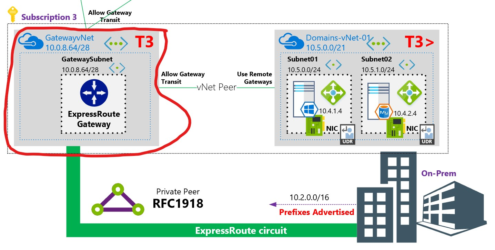

# The Azure 3 Tier Network
For the serious security concious, this is one way to do networks from within Azure. In brief, the T1 vNet can't talk directly with the T3 vNet and vice versa. 

  

## Azure-T3-Network
This repo is for the Tier 3 part of the 3 tier network.

  

To deploy the most trusted T3 bottom layer of this Azure network:

